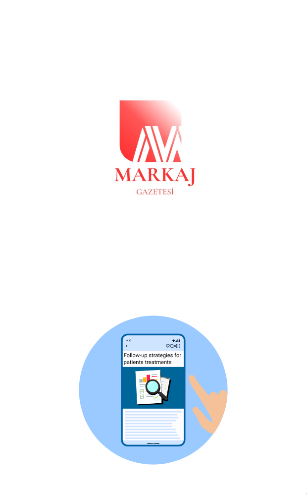
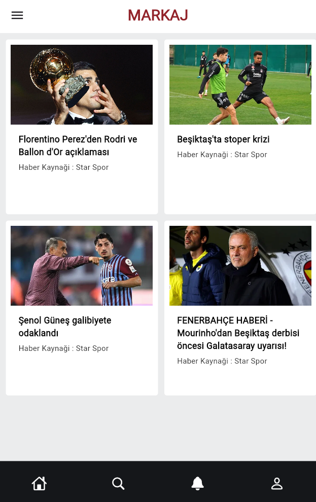
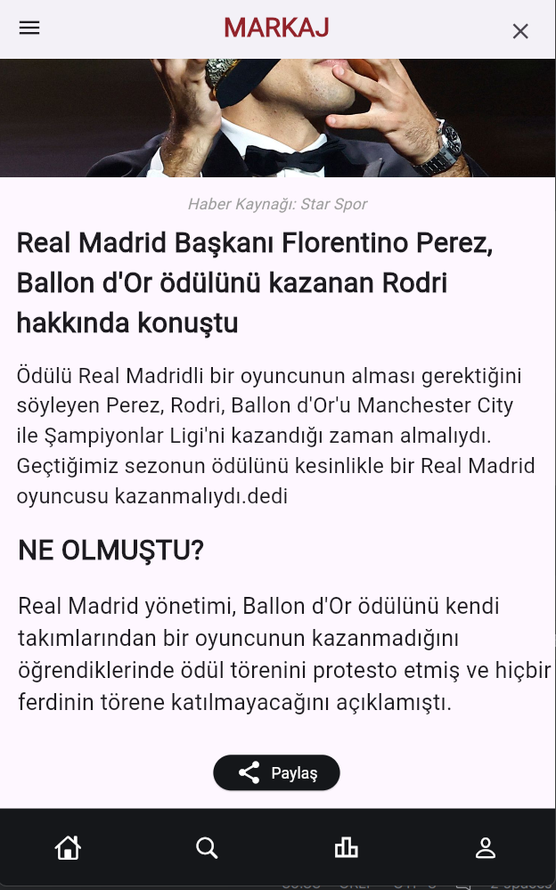

# Flutter Projesi


## Proje Hakkında

[Bu uygulamamız, kullanıcıları Dünyadaki başlıca Futbol ve Spor dalları ile ilgili anlık haberleri sunarak bilgilendirir ve gündem akışında tutar.
Kullanıcılar bu uygulamayla farklı spor dallarını görüntüleyebilir ve bilgileri ,haberleri tek bir uygulamada sunar ve paylaşır.]


## Ekibimiz

-  **Danışman:**    
   [https://github.com/keyvanarasteh] (Keyvan Arasteh)


-  **Takım Üyeleri:**

1 -  [https://github.com/alperenkarademir] (alperenkarademir)  
2 - [https://github.com/Emirhanbgdyc] (Emirhanbgdyc)
3 - [https://github.com/Emirbulutt] (Emirbulutt)


## Özellikler

- [Yükleme Sayfası]

- [Sıde Bar]

- [Haber Arama Sayfası]


## Kullanılan Teknolojiler

- Flutter

- Dart

- Visual Studio Code

- Android Studio Code 


## Başlangıç


### Gereksinimler

- Flutter SDK (3.24.4)

- Dart SDK (3.5.4)

- DevTools (2.37.3)


### Kurulum Adımları

1. Projeyi bilgisayarınıza indirin:

```bash  
  
git  clone [https://github.com/Emirhanbgdyc/Markaj_Gazetesi.git]  
  
```  


2. Proje klasörüne gidin:

```bash  
  
cd [markaj_gazetesi]  
  
```  


3. Gerekli paketleri yükleyin:

```bash  
  
flutter  pub  get  
  
```  


4. Uygulamayı başlatın:

```bash  
  
 flutter  run  
```  


## Proje Yapısı

```  
  
lib/  
  
├── modeller/ # Veri modelleri  
  
├── ekranlar/ # Uygulama ekranları  
  
├── widgets/ # Tekrar kullanılabilir arayüz öğeleri  
  
├── servisler/ # API servisleri  
  
└── yardımcılar/ # Yardımcı fonksiyonlar  
  
```  


## Ekran Görüntüleri







## Projeye Katkı Sağlama

1. Projeyi forklayın

2. Yeni bir dal oluşturun (`git checkout -b ozellik/YeniOzellik`)

3. Değişikliklerinizi kaydedin (`git commit -m 'Yeni özellik eklendi'`)

4. Dalınıza gönderin (`git push origin ozellik/YeniOzellik`)

5. Pull Request oluşturun


## Lisans

Bu proje [MIT Lisansı](./LICENSE) altında lisanslanmıştır. Daha fazla bilgi için LICENSE dosyasına göz atabilirsiniz.


## İletişim

- Proje Bağlantısı:[https://github.com/Emirhanbgdyc/Markaj_Gazetesi] 

- İstinye Üniversitesi: [https://www.istinye.edu.tr/](https://www.istinye.edu.tr/)


## Teşekkürler

- İstinye Üniversitesi'ne destekleri için teşekkür ederiz


  
  
  
  
